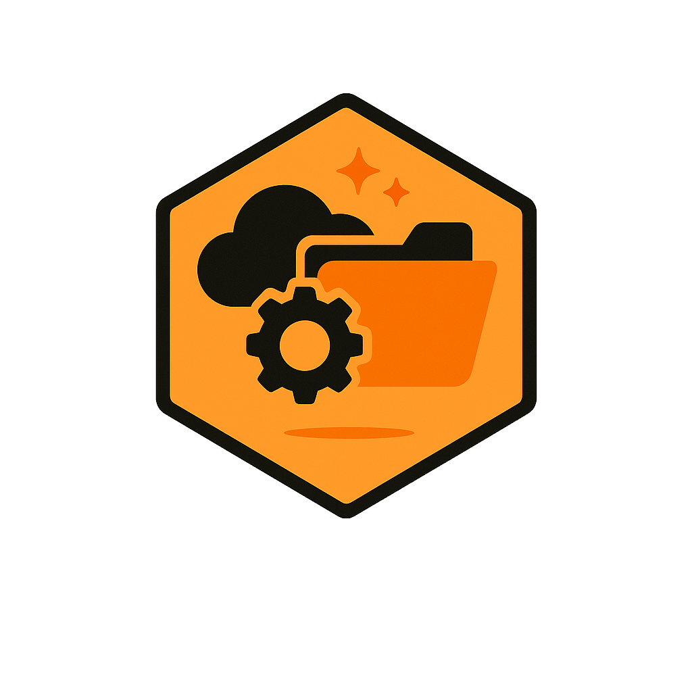

# LocalWorkHive

  

# 🐝 LocalWorkHive
**LocalWorkHive** is a project designed to facilitate working with AWS services and practicing API development. It enables simulation of AWS resources like S3 on a local machine using LocalStack.

This project is intended to be used as a lab to test new and interesting technologies and libraries.

The project was created to simplify and speed up the development of local MVPs. Currently, it provides an API for managing **Amazon S3**, supporting bucket and file operations.

---

### ⚠️ Warning

> **Note:** This project is under active development and may never be considered “complete,” as it serves as an experimental lab for testing new ideas and technologies.

> This project is intended for **local execution only**, using [LocalStack](https://github.com/localstack/localstack) to simulate AWS services locally.  

> It aims to accelerate the development of prototypes and MVPs by managing simulated resources such as S3, DynamoDB, and SQS without requiring access to real AWS infrastructure.

**Not suitable for production environments.**

---

### 📦 Version

- **1.0.0** — Initial release with basic funcionalities
   -  S3 supports (files and buckets)
 
integration.
#### 📦 Bucket Management
- Create buckets
- Delete buckets
- Retrieve bucket metadata
- List all buckets

#### 📁 File Management
- Upload files to buckets
- Delete files from buckets
- Retrieve files from buckets
- List files within buckets

#### 🧪 Development Details
- Built with FastAPI and Pydantic to standarize models.
- Unit tests using `unittest` and mocks
- Modular code structure with routes, schemas, and helpers
- AWS services simulated via LocalStack

---

### 🚧 Planned Features

Future development plans include expanding support beyond S3:

  #### 🗄️ DynamoDB
  - Create and delete tables
  - Add, update, retrieve, and delete items
  - Support for querying and scanning data

  #### 💬 SQS
  - Create and delete queues
  - Send and receive messages
  - Dead-letter queue support for retries

  #### 🐘 PostgreSQL
  - Integration with Docker Compose or local PostgreSQL instance
  - Basic API for CRUD operations
  - Simulates a persistence layer for MVPs requiring relational databases

  #### 🔮 GraphQL Support (Planned)
  - Implementation of GraphQL queries and mutations to enhance API flexibility and efficiency

---

### 📬 Contact
[LinkedIn profile](https://www.linkedin.com/in/diogosilvaf/).